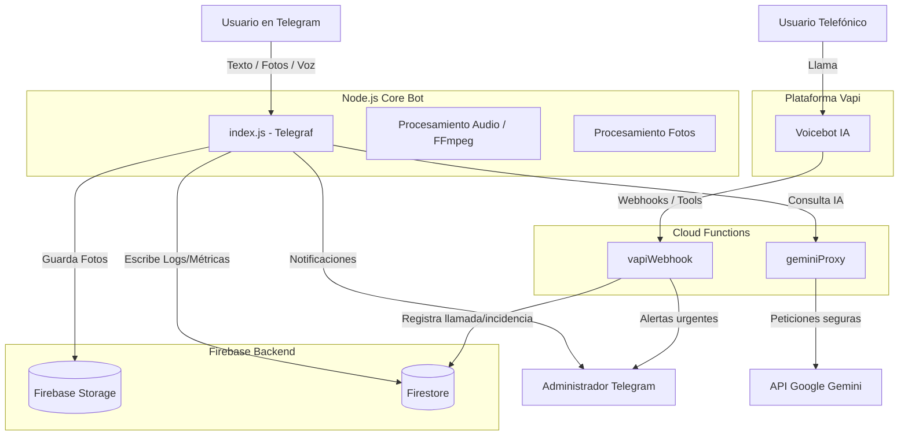

# 🚗 Corporin - Asistente Inteligente Multimodal (AVIS Canarias)

**Corporin** es un ecosistema de asistencia virtual de vanguardia diseñado para el soporte de clientes corporativos de AVIS en las Islas Canarias. Utiliza Inteligencia Artificial Generativa (Google Gemini) para ofrecer una experiencia multimodal (Texto, Voz e Imagen) y omnicanal (Telegram y Teléfono).

---

## 🌟 Características Destacadas

*   **🧠 IA Multimodal (Gemini 2.5 Flash):** Capacidad para analizar textos complejos, fotos de incidencias/daños y notas de voz simultáneamente.
*   **📞 Integración de Voz (Vapi + Deepgram):** Soporte para llamadas telefónicas automáticas con latencia mínima, utilizando voces neuronales de alta calidad.
*   **🤖 Orquestación Multi-mensaje (Debounce):** Sistema inteligente que agrupa mensajes consecutivos del usuario para procesarlos como una única unidad de contexto.
*   **🛡️ Arquitectura Segura (Proxy LLM):** Las API Keys de inteligencia artificial están protegidas tras una capa de **Google Cloud Functions**, evitando exposición en el cliente.
*   **📡 Alertas en Tiempo Real:** Sistema de triaje automático que detecta emergencias y notifica al instante a los administradores vía Telegram.
*   **📊 Telemetría y Métricas:** Registro detallado en **Firestore** de cada interacción para análisis de sentimiento, uso de tokens y efectividad del soporte.

---

## 🏗️ Diagrama de Arquitectura

El sistema está diseñado bajo una arquitectura modular y serverless para garantizar escalabilidad y seguridad:



---

## 🔍 Flujos de Operación

### 1. El Sistema de "Debounce"
Para evitar que la IA procese mensajes fragmentados, el bot utiliza un temporizador inteligente de 2.5s que reinicia el buffer cada vez que llega un nuevo elemento (texto, audio o foto), permitiendo que el usuario envíe una incidencia completa antes de generar una respuesta.

### 2. Capa de Seguridad (Proxy)
El bot principal **no tiene acceso directo** a las llaves de Gemini. Realiza peticiones a `geminiProxy` (Cloud Function), donde reside la lógica de autenticación y el manejo de cuotas.

### 3. Escalado Automático
La IA busca etiquetas de instrucción en sus propias respuestas como `[NOTIFICAR_ADMIN]` o `[ENVIAR_EMAIL]`. El orquestador detecta estas etiquetas, ejecuta la acción (notificar al humano) y limpia la respuesta antes de que el usuario final la vea.

---

## 📁 Organización del Proyecto

Tras la última optimización, el proyecto sigue esta estructura:

*   `/index.js`: Orquestador principal del bot de Telegram.
*   `/scripts/`: Más de 100 herramientas de utilidad, tests y scripts de debug.
*   `/docs/`: Documentación técnica detallada y especificaciones de IA.
*   `/functions/`: Lógica serverless (Proxy Gemini y Webhooks Vapi).
*   `/data_exports/`: Logs temporales y volcados de métricas locales.
*   `/servicevoice/`: Configuración del asistente de voz telefónico.
*   `/public/` & `/dashboard/`: Interfaces para monitorización de métricas.

---

## 🚀 Instalación y Despliegue

### Requisitos
*   Node.js v18+
*   Firebase CLI configurado
*   FFmpeg instalado en el servidor

### Configuración
1.  Clonar el repositorio.
2.  Crear archivo `.env` con `TELEGRAM_BOT_TOKEN` y `GEMINI_PROXY_URL`.
3.  Añadir `credentials.json` (Firebase Service Account).
4.  Instalar dependencias: `npm install`.

### Ejecución
```bash
# Iniciar Bot de Telegram
node index.js

# Desplegar Funciones de Cloud
firebase deploy --only functions
```

---

## 🛠️ Tecnologías Empleadas
- **Telegraf** (Telegram API)
- **Firebase** (Firestore, Storage, Hosting, Functions)
- **Google Gemini 2.5 Flash** (IA Generativa)
- **Vapi** (Voice Orchestration)
- **Fluent-FFmpeg** (Media Processing)
- **Google TTS** (Voice Synthesis)
