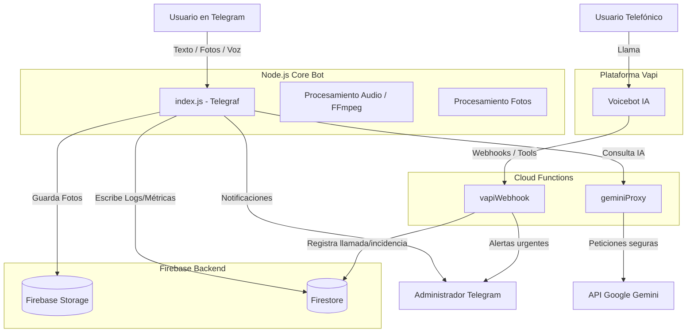

# Arquitectura del Proyecto Corporin AVIS

Este documento resume la arquitectura general del proyecto **Corporin AVIS**, un sistema de asistencia inteligente (chatbot y voicebot) diseñado para resolver dudas y gestionar incidencias de clientes corporativos de AVIS en Canarias.

El proyecto está compuesto por varios módulos interconectados, apoyándose fuertemente en **Node.js**, **Firebase** y servicios de **Google Cloud/Gemini**.

---

## 1. Módulos Principales

### 1.1. Core Bot (Telegram) - `index.js`
Es el núcleo principal de la aplicación, implementado como un bot de Telegram utilizando la librería `telegraf`. 
- **Procesamiento Multimodal**: 
  - **Texto**: Recopila mensajes de los usuarios con un sistema de *debounce* (espera unos segundos para agrupar mensajes consecutivos).
  - **Voz**: Descarga audios en formato `.ogg` de Telegram, los convierte a `.wav` localmente usando `fluent-ffmpeg` y los procesa.
  - **Imágenes**: Sube las fotos a **Firebase Storage** y pasa la URL y los datos en Base64 a la IA para analizar daños o suciedad.
- **Respuestas de Voz (TTS)**: Utiliza `google-tts-api` para generar respuestas en audio si el usuario se comunicó originalmente por voz, uniendo fragmentos y ajustando la velocidad de reproducción.
- **Acciones y Triggers**: Interpreta la respuesta del modelo de IA buscando etiquetas ocultas como `[NOTIFICAR_ADMIN]` (para emergencias) o `[ENVIAR_EMAIL]` (para reportes al equipo de soporte). Si detecta urgencias, notifica al administrador en Telegram.
- **Registro de Métricas**: Guarda métricas en local (`logs/metrics.jsonl`) y las sincroniza con **Firestore** (colección `metrics`).

### 1.2. Backend Serverless (Firebase Cloud Functions) - `functions/index.js`
Actúa como capa de seguridad y puente de integración, alojando funciones HTTPS:
- **`geminiProxy`**: Un proxy seguro para llamar a la API de Google Gemini (Gemini 2.5/2.0/1.5 Flash). El Core Bot hace las peticiones a este proxy, evitando así tener expuesta la API Key (almacenada en Cloud Secrets). Tiene lógica de *fallback* entre diferentes modelos y versiones de API.
- **`vapiWebhook`**: Webhook para la integración telefónica con **Vapi**. Recibe eventos del voicebot, incluyendo:
  - `tool-calls`: Por ejemplo, si la IA decide usar la herramienta `reportar_incidencia`, esta función recibe el evento, lo guarda en Firestore y avisa al Administrador por Telegram.
  - `end-of-call-report`: Recibe la transcripción y el resumen al finalizar la llamada y los registra en Firestore.
- **`deployVapiAssistant`**: Función de utilidad para desplegar la configuración del asistente de voz directamente en la plataforma Vapi.

### 1.3. Integración de Voz Telefónica (Vapi) - `servicevoice/`
Configuración específica para el agente telefónico autónomo "Corporín".
- **`config.js`**: Define el prompt del sistema, las voces (usa Azure `es-ES-ElviraNeural`), el motor de transcripción (Deepgram) y el modelo de IA (`gemini-2.0-flash`).
- Define herramientas (Tools) como `reportar_incidencia` que permiten a la IA telefónica realizar acciones que impactan en el backend (Cloud Functions).

### 1.4. Dashboard Local - `dashboard/`
Un sistema de visualización de métricas.
- **`server.js`**: Un pequeño servidor Express (puerto 3000) que expone una API `/api/metrics` para leer el archivo local `logs/metrics.jsonl` y sirve los archivos estáticos desde `dashboard/public`.

---

## 2. Bases de Datos y Almacenamiento (Firebase)

El proyecto depende en gran medida de los servicios de Firebase para la persistencia:
- **Firestore (Base de Datos NoSQL)**: Centraliza toda la telemetría y logs.
  - `logs_attempts`: Registros de los intentos e inputs del usuario.
  - `logs_emails`: Simula y guarda el registro de emails generados por el bot.
  - `metrics`: Métricas consolidadas (incluyendo feedback de los usuarios, uso de tokens, urgencia y plataforma origen - Telegram o Voz).
  - `logs_incidencias_voz` / `vapi_debug_logs`: Auditoría de la integración con Vapi.
- **Firebase Storage** (`corporin-avis-chatbot.firebasestorage.app`): Almacena de forma persistente las imágenes enviadas por los usuarios (fotos de los coches, daños, etc.) generando URLs firmadas de larga duración que se asocian a las incidencias.

---

## 3. Flujo de Datos (Arquitectura de alto nivel)

## Resumen para el Desarrollador
1. **Punto de Entrada Telegram**: `index.js` en la raíz. Presta atención al "debounce" para la recolección de mensajes y a la limpieza de texto (tags como `[NOTIFICAR_ADMIN]`).
2. **Seguridad de LLM**: La comunicación con Gemini NUNCA se hace directa desde el bot principal. Siempre pasa por la función `geminiProxy` en `functions/index.js`.
3. **Telemetría**: Cualquier métrica nueva debe registrarse llamando a la colección de Firestore para que esté disponible en la nube, y opcionalmente en el `.jsonl` local.
4. **Voz (Vapi)**: Si necesitas modificar cómo el bot responde por teléfono, debes editar `servicevoice/config.js` y desplegar los cambios (probablemente usando la función `deployVapiAssistant`). El manejo de sus acciones lógicas reside en `vapiWebhook`.
